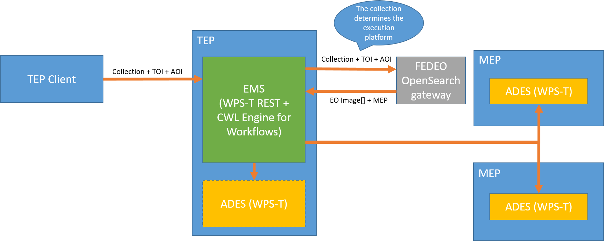

[[Tb14Recap]]
== Recap Of Work Done In Testbed-14

=== Testbed-14 Earth Observation and Cloud (EOC) thread

The following Engineering Reports are relevant to this work:

* OGC Testbed-14: ADES & EMS Results and Best Practices Engineering Report cite:[TB14ADESEMS2018]
* OGC Testbed-14: Application Package Engineering Report cite:[TB14AP2018]
* OGC Testbed-14: Federated Clouds Engineering Report cite:[TB14FC2018]
* OGC Testbed-14: Machine Learning Engineering Report cite:[TB14ML2018]

==== Architecture

The figure below is taken from the Testbed-14 ADES&EMS best practices ER cite:[TB14ADESEMS2018] and shows the architecture adopted. The main building blocks included the Client, the Execution Management Service (EMS), the FEDEO OpenSearch gateway and an Application Deployment and Execution Service (ADES). While OpenSearch, ADES and the client play an important role in the Earth Observation and Clouds (EOC) thread of Testbed-14, they are not really considered in the current report. This report focus on an extension to the EMS allowing support of a large variety of applications types. The desired outcome is a backward compatibility with existing infrastructure, all while extending compatibility with process providers using their own interfaces.

[#img_architecture,reftext='Figure {counter:figure-num}']

==== Interfaces
===== WPS-T REST/JSON

The Testbed-14 help us to design a RESTful protocol for the WPS interface based on the cooperation of both the EOC thread and WPS SWG. The interface has been choosen to serve both the ADES and the EMS as they share the same functionality set. The complete specification defined using OpenAPI can be found in https://github.com/opengeospatial/D009-ADES_and_EMS_Results_and_Best_Practices_Engineering_Report/blob/master/code/ades_wpst.json[here]. This interface proposes how to deploy, list, execute and monitor processes, as well as getting back the process result. While the specification covers more than that, these are the main operations on which this report will focus.

==== Application Package

The Application Package ER cite:[TB14AP2018] defined how the applications should be packaged. It introduced a novel way to capture how the parameters could be passed to the application and the results retrieved.  A WPS-T DeployProcess document defines the application’s inputs and outputs, as well as the execution unit. The novel way to define that execution unit is to add a Common Workflow Language (CWL cite:[CWL2016]) file that is exactly conceived to describe how to execute Docker application and how parameters and results can be provided and retrieved. Each WPS inputs can precisely map to the Docker command line arguments. The output can be easily retrieved by mounting a volume inside the Docker container where the output is expected to be created. The DeployProcess document still support defining directly the Docker image as an execution unit,   but in that case ows:metadata must be provided to emulate what is contained in the CWL. The current report describes the modification to the CWL execution unit and shows how it can be used to easily make the EMS more versatile.

==== Application Chaining

Application chaining is an important part of the Tesbed-14. Proposed interoperability experiments involve simple chaining, where in a workflow composed of application A and B, output of A being fed into B. Both applications are packaged as Docker images and their execution is forwarded to an ADES. That forwarding is dynamic. Based on the data source, the system determines where execute the application should occur, so that the data does not have to be moved around. That implies that at runtime an ADES is targeted based on the data source, hence the application is deployed to that ADES. It is then executed before deployment of the second application, parametrized with the output of the first one.

==== CRIM's implementation

The EMS implementation is based on components of the Open Source software framework Birdhouse cite:[EHBRECHT2018]. The https://github.com/Ouranosinc/twitcher[Twitcher] component acts as a Policy Enforcement Point (PEP). It has been extended to offer an WPS 2.0 JSON proxy to WPS 1.0 endpoints, and to comply to the EMS API which involves adding the dynamic deployment of processes and CWL workflow capabilities. The https://github.com/Ouranosinc/Magpie[Magpie] component is used as an adapter to manage ACLs of deployed processes and process permissions (WPS requests) for a given user’s credentials. The following component diagram shows the relation between Twitcher and Magpie, but put the emphasis on the Twitcher component.

.EMS component developed by CRIM and proposed extension to other WPS interfaces.
image::images/OGC_TB14.png[width=650,align="center"]

Incoming requests initially hit the top left proxy connector, that first perform an authorization using the Magpie component. If the user is allowed, the request is forwarded by the proxy to the bottom left WPS-T interface, which implement the OpenAPI describe above. Submitted jobs are managed in a queue implemented using Celery cite:[TB13CLOUDER2017]. The handler forwards the job to a legacy WPS 1.0 PyWPS server which perform all the parameters validation. All jobs are then processed by the CWL engine which can execute the job in situ, if playing the ADES role, or an EMS forwarding it to the proper ADES based on the data source.
