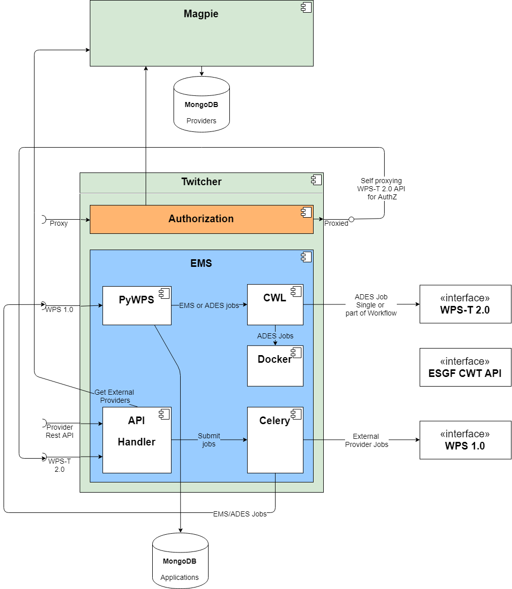

[[Tb14Recap]]
== Recap Of Work Done In Testbed-14

=== Testbed-14 Earth Observation and Cloud (EOC) thread
==== Cloud computing
Cloud ER cite:[TB13CLOUDER2017]

==== Architecture

The figure below is taken from the Testbed-14 ADES&EMS best practices ER cite:[TB14ADESEMS2018] and shows the architecture adopted. The main building blocks included the Client, the Execution Management  Service (EMS), the FEDEO OpenSearch gateway and some Application Deployment and Execution Service (ADES). While the OpenSearch, ADES and Client play an important role in Testbed-14, they are not really considered in the current report because this report focus on an extension to the EMS so that it can support a large variety of applications type both for backward compatibility with existing infrastructure and to extend the compatibility with process providers using their own interface.

[#img_architecture,reftext='Figure {counter:figure-num}']
image::images/Architecture.png[title="Final Testbed-14 EOC Thread Architecture"]

==== Interfaces
===== WPS-T REST/JSON

The Testbed-14 help us to design a RESTful protocol for the WPS interface based on the cooperation of both the EOC thread and WPS SWG. The interface has been choosen to serve both the ADES and the EMS as they share the same functionality set. The complete specification, defined using OpenAPI, can be found in https://github.com/opengeospatial/D009-ADES_and_EMS_Results_and_Best_Practices_Engineering_Report/blob/master/code/ades_wpst.json. This interface proposes how to deploy, list and execute processes as well as monitoring them and getting back the process result. There is more than that, but these are the main operations on which we will focus in this report.

==== Application Package

The Application Package ER cite:[TB14AP2018] has finally fixed how the applications should be packaged and introduced a novel way to capture how the parameters could be passed to the application and the results retrieved. It consists of a WPS-T DeployProcess document through which the application’s inputs and outputs are described and the execution unit can be defined. The novel way to define that execution unit is to add a Common Workflow Language (CWL) file that is exactly conceived to describe how to execute Docker application and how parameters and results can be provided and retrieved. That way each WPS inputs can be precisely map to the Docker command line arguments and the output can be easily retrieved by mounting a volume inside the Docker container where the output is expected to be created. The DeployProcess document still support defining directly the Docker image as an execution unit   but in that case some ows:metadata must be provided to emulate what is contained in the CWL. In the current report we will capitalize on the CWL execution unit and show how it can be used to easily make the EMS more versatile.

==== Application Chaining
-> Not sure how to link with that : Workflows CWL cite:[CWL2016]

Application chaining has been an important part of the Tesbed-14 too, but we have concentrate our effort on doing a simple chaining that is running a workflow composed of application A and B, output of A being fed into B and that's it. Both applications was packaged as Docker and their execution was forward to an ADES. That forwarding was dynamic, meaning that based on the data source we were able to decide where we should execute the application so that the data does not have to be moved around. That imply that at runtime an ADES was targetted based on the data source, and then the application was deployed to that ADES and then executed before deploying the second application and calling it with the output of the first one.

==== CRIM's implementation

The EMS implementation has been based on components of the Open Source software framework Birdhouse [8]. The Twitcher [https://github.com/Ouranosinc/twitcher] component acts as a Policy Enforcement Point (PEP) and has been extended to offer an WPS 2.0 JSON proxy to WPS 1.0 endpoints. It has been enhanced to comply to the EMS API which involves adding the dynamic deployment of processes and CWL workflow capabilities. The Magpie [https://github.com/Ouranosinc/Magpie] component is used as an adapter to manage ACLs of deployed processes and process permissions (WPS requests) for a given user’s credentials.The following component diagram shows the relation between Twitcher and Magpie but put the emphasis on the Twitcher component. We are able to see that incoming requests first hit the top left proxy connector that first perform an authorization using the Magpie component. If the user is allowed the request is forwarded by the proxy to the bottom left WPS-T interface which implement the OpenAPI describe above. When jobs are submitted a celery queue take care of them and the handler forward the job to a legacy WPS 1.0 PyWPS server which perform all the parameters validation. All jobs are then processed by the CWL engine which can execute the job in situ, if playing the ADES role or forwarding it to the proper ADES based on the data source.

.EMS component developed by CRIM and proposed extension to other WPS interfaces.

=== Other relevant Testbed-14 work
Federated Clouds ER cite:[TB14FC2018]
Machine Learning ER cite:[TB14ML2018]

=== Climate components of Testbed-14 implementation
Projects using the Birdhouse framework cite:[EHBRECHT2018]

