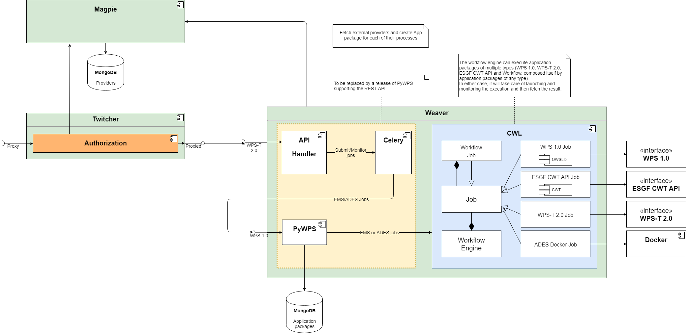

[[Solution]]
== Solution

Section 7 presents the solution adapting Testbed-14 implementations towards interoperability with ESGF compute nodes. The section revisits the architecture, introduces two new profiles and offers code samples for integration of deployed services into workflows.

=== Architecture

The goal of the extension presented in this report is to improve the EMS in order to increase compatibility across existing systems. The EMS provided for Testbed-14 offers a WPS-T 2.0 interface, yet should be able to run multiple application types and use them in heterogeneous workflows. Using a single interface should allow execution of a large array of existing applications and, moreover, use them inside workflows. Two new application types are considered in this project. The first is for backward compatibility and consists of execution of existing process served by WPS 1.0 endpoint. The second is to broaden furthermore the application scope by covering the <<ESGFCompute, ESGF Compute Working Team (CWT) API>>.

Multiple approaches have been considered to achieve this goal. The first approach is to keep the EMS as is, package every type of application into Docker images, and provide alongside them a CWL describing invocation mechanisms. However, packaging existing providers would yield a huge Docker images with multiple processes. This could simply prove impossible for external providers for which the code is unavailable. The second approach, much simpler, defeats however one of the principles of Testbed-14 which is to bring the application to the data. This approach consists of packaging all the information required to make a standard WPS 1.0 or ESGF CWT API request.

A DeployProcess document is still provided but two new profile names have been introduced, _wpsApplication_ and _ESGFWpsApplication_, that require fewer elements as everything needed can be extracted from the existing endpoints. In the WPS 1.0, the CWL file can even be generated transparently at deployment time since the parameters mapping is trivial. The CWL file itself allows to specify execution requirements so that the engine can change the execution unit and perform a classic WPS 1.0 or ESGF CWT API execute request, without a prior deployment request.

.New EMS component called Weaver and its workflow packages.

In Testbed-14, CRIM's EMS implementation was all contained in a component named Twitcher. That component is now separated into two components, so that each one can focus primarily on its own role and make the architecture simpler. The previous diagram resumes the situation. The WPS-T interface and CWL engine introduced in Twitcher are moved to a new component named https://github.com/crim-ca/weaver[Weaver]. Twitcher now operates as a security proxy along with the permission provider, Magpie. The relation between the CWL workflow engine, the job interface and all the available implementation for each of the application types are depicted in the previous figure.

=== Application Package

This subsection describes the various application profiles developed and introduces their integration into workflow. Subsetting and climate indices calculation are also introduced as key processes relevant to ESGF.

==== Process Deployment

The DeployProcess document conforms to the existing API but requires fewer optional elements. Using the wpsApplication deployment profile name, it only requires the process id and an execution unit referencing a WPS 1.0 endpoint. Inputs, outputs and CWL file can be implicitly deduced.

Below is a JSON file deploying a WPS 1.0 endpoint offering computation of climate indices. In this case, the WPS component named https://github.com/bird-house/finch[Finch] exposes the https://xclim.readthedocs.io/en/latest/readme.html[xclim] Python library developed by Ouranos and funded in part by Environment and Climate Change Canada (ECCC). This library is based on Xarray and benefits from the parallelization provided by Dask. XClim has for objective to make it as simple as possible for users to compute indices from large climate datasets, and for scientists to write new indices with very little boilerplate. The example below returns _Ice Days_, which takes into account the number of days in which the temperature never rises above 0 degrees Celsius and stays below freezing point.

.JSON file for a WPS 1.0 process deploy request
[source,json]
----
{
    "processDescription": {
        "process": {
            "id": "Finch_IceDays"
        }
    },
    "executionUnit": [
        {
            "href": "https://finch.crim.ca/wps?service=WPS&request=describeprocess&version=1.0.0&identifier=ice_days"
        }
    ],
    "deploymentProfileName": "http://www.opengis.net/profiles/eoc/wpsApplication"
}
----

For the ESGF CWT processes, the CWL must be provided as a reference or inlined, since parameter mapping is more involved than for WPS 1.0. This is discussed further in the <<Discussion, Discussion>> section. Below is a JSON file deploying a WPS 1.0 endpoint enforcing the ESGF CWT API. In that case, the example is a subsetting process offered by NASA EDAS. This process is conceptually similar to setting an area and time of interest to Earth observation data, and returning the extracted data.

.JSON file for an ESGF CWT process deploy request
[source,json]
----
{
    "processDescription": {
        "process": {
            "id": "nasa_esgf_subset"
        }
    },
    "executionUnit": [
        {
            "unit": {
                <cwl file content show below>
            }
        }
    ],
    "deploymentProfileName": "http://www.opengis.net/profiles/eoc/ESGFWpsApplication"
}
----

==== Workflow Integration

The CWL file is modified so that the CWL engine can instantiate the appropriate job implementation. To that effect, the hints section of the CWL file are used. This replaces the traditional _DockerRequirement_ value for extensions requirements, which are _WPS1Requirement_ and _ESGF-CWTRequirement_. Under that key, a dictionary containing all the parameters required to make an execute request to WPS 1.0 provider is added. The only difference with the CWL provided during Testbed-14 is the hints section declaring the WPS1Requirement and two parameters: the provider endpoint and the process which is wrapped. The file format is also now enforced in the CWL file. Below, a CWL example file describes one of the climate processes for the WPS 1.0 provider. A full example of the CWL file, containing inputs and outputs, can be found in <<CWL_WPS1_Finch, Annex B>>.

.Excerpt of CWL file for the ice_days process of Finch WPS 1.0 provider
[source,json]
----
{
  "cwlVersion": "v1.0",
  "$namespaces": {
    "edam": "http://edamontology.org/"
  },
  "class": "CommandLineTool",
  "hints": {
    "WPS1Requirement": {
      "process": "ice_days",
      "provider": "https://finch.crim.ca/wps"
    }
  },
  "inputs": {<...>},
  "outputs": {<...>}
  }
}
----

When the CWL engine encounters the file presented above, it recognizes the WPS1Requirement thus creating a WPS 1.0 Job. That job uses the same interface as the WPS-T 2.0 Job, but rather than deploying and executing an application on a remote ADES, it calls the WPS 1.0 execute request of the provider and process given in parameters. The result is then fetched similarly to the ADES implementation. In the following CWL excerpt, the _ESGF-CWTRequirement_ triggers the creation of CWT Job that will use the ESGF-compute-api Python package to run the process with a proper parameters mapping. Once again, there is no deployment involved and once the process execution completes, the result is fetched. A full example of the CWL file, containing inputs and outputs, can be found in <<CWL_WPS1_EDAS, Annex C>>.

.Excerpt of CWL file for the NASA EDAS Subset process
[source,json]
----
{
    "cwlVersion": "v1.0",
    "class": "CommandLineTool",
    "hints": {
        "ESGF-CWTRequirement": {
            "provider": "https://edas.nccs.nasa.gov/wps/cwt",
            "process": "xarray.subset"
        }
    },
    "inputs": {<...>},
    "outputs": {<...>}
    }
}
----
