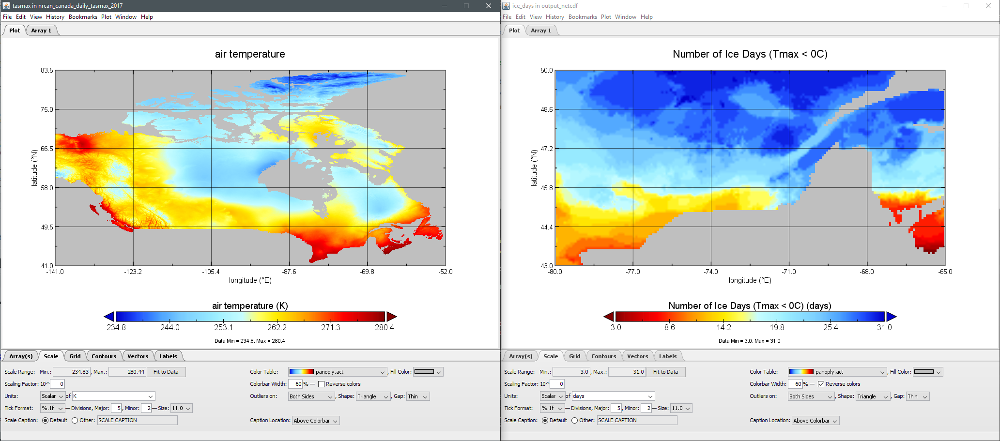
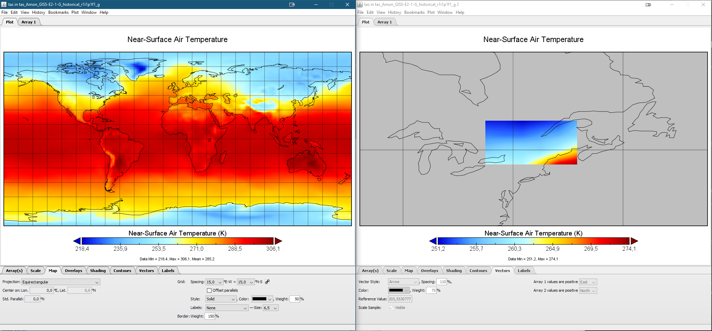

[[TIEs]]
== Applications and workflows

Section 8 documents interoperability experiments conducted between CRIM's EMS, LLNL AIMS and NASA EDAS endpoints in context of ESGF compute challenge. The section presents execution body samples and workflows.

=== ESGF CWT Applications

Currently, only a small portion of the ESGF WPS processing is implemented in Weaver. This is largely due to the fact that ESGF WPS inputs are nested, and this nested structure must be translated to a flat one to correspond to standard WPS inputs or to Weaver's inputs. Some of these nested parameters are easy to implement, because they are always the same across each process, but others can't be automatically queried. A full example JSON file, containing all required inputs and outputs for the process, can be found in <<JSON_CWT_execute, Annex D>>. Below is an excerpt of an execution body.

.Excerpt of a JSON file of a CWT process execute body
[source,JSON]
----
{
  "mode": "async",
  "response": "document",
  "inputs": [
      {
         "id": "files",
         "href": "https://boreas.ouranos.ca/twitcher/ows/proxy/thredds/dodsC/birdhouse/nrcan/nrcan_northamerica_monthly/tasmin/nrcan_northamerica_monthly_2015_tasmin.nc"
      },
      {
         "id": "variable",
         "data": "tasmin"
      },
      {
         "id": "api_key",
         "data": "{{ api_key }}"
      },
      {
         "id": "time_start",
         "data": "0"
      },
      {
         "id": "lat_start",
         "data": "60"
      },
      <...>
  ],
  "outputs": [
    {
      "id": "output",
      "transmissionMode": "reference"
    }
  ]
}
----

The 'files' and 'variable' correspond to the ESGF CWT API 'Variable' input, as described in <<ESGFCompute, ESGF section>>. The 'api_key' must be obtained by creating an account on the Lawrence Livermore National Laboratory (LLNL) web site. The other inputs are a flat representation of the ESGF 'Domain' input. So far, the time and lat/lon attributes are present in every NetCDF file encountered so they are easy to implement and re-use for each process. The ESGF processes successfully tested are 'CDAT.aggregate' and 'CDAT.subset', deployed on AIMS2 servers.

=== Application Chaining

For the application chaining, CWL engine is now able to process all type of application only by instantiating the proper job type. To demonstrate that interoperability, two workflows have been produced and will be presented in this section. Beforehand, utility applications will be introduced.

==== Utility applications

This concept has been added to further improve compatibility. They are small python applications, still packaged as CWL, that can make some adaptation between related type. For example, some application yields JSON file containing array of NetCDF files. The JSON output is therefore incompatible with an application wanting NetCDF files as inputs. The utility application can be chained between the two. This way, the CWL engine feeds the JSON output into the utility apps that will provide an array of NetCDF files, ready to be consumed by the next application. These applications are really lightweight because the CWL file is only wrapping a Python function already inside the Weaver EMS component. Below is a sample CWL file of the JSON to NetCDF.

.CWL file for the JSON to NetCDF utility application
[source,python]
----
#!/usr/bin/env CWL-runner
CWLVersion: v1.0
$namespaces:
  iana: "https://www.iana.org/assignments/media-types/"
  edam: "http://edamontology.org/"
class: CommandLineTool
baseCommand: python
arguments: ["-m", "weaver.processes.builtin.jsonarray2netcdf", $(runtime.outdir)]
inputs:
 input:
   type: File
   format: iana:application/JSON
   inputBinding:
     position: 1
outputs:
 output:
   format: edam:format_3650
   type:
     type: array
     items: File
   outputBinding:
     glob: "*.nc"
----

==== Workflow chaining WPS 1.0 processes

The first workflow consists of a subsetter and a climate indices process. The deploy body is exactly the same as in Testbed-14 as shown here. It contains the deployment profile name indicating that it is a workflow, a process id and a CWL reference containing the workflow.

.JSON file for the WPS 1.0 workflow
[source,JSON]
----
{
    "processDescription": {
        "process": {
            "id": "WorkflowSubsetIceDays",
            "title": "Workflow of Subset and Ice Days",
            "abstract": "Workflow that first executes a bounding box subset of a region and afterwards calculates days with ice within the obtained region."
        }
    },
    "executionUnit": [
        {
            "href": "tests/functional/application-packages/workflow_subset_ice_days.CWL"
        }
    ],
    "deploymentProfileName": "http://www.opengis.net/profiles/eoc/workflow"
}
----

The CWL is also built the same way as in Testbed-14. It contains the class indicating that it is a workflow, the workflow inputs and outputs and the steps referencing CWL files. This workflow contains two WPS 1.0 steps and one utility json2nc step converting the output type of the first step into an acceptable type for the third one as introduced in the previous section. Below is an excerpt of the CWL files, where some details where removed for concision. A complete listing of this CWL file can be found in <<JSON_WPS1_workflow, Annex E>>. To execute that workflow, the same execute request body as in Testbed-14 is used. The complete execute request body for the workflow can be found in <<JSON_WPS1_workflow_body, Annex F>>.

.Excerpt of a CWL file of the WPS 1.0 workflow
[source,json]
----
{
    "cwlVersion": "v1.0",
    "class": "Workflow",
    "requirements": [
        {
            "class": "StepInputExpressionRequirement"
        }
    ],
    "inputs": {<...>},
    "outputs": {<...>},
    "steps": {
        "subset": {<...>},
        "json2nc": {<...>},
        "ice_days": {<...>}
    }
}
----

In <<JSON_WPS1_workflow_body, Annex F>>, the "tasmax" input provides a reference to a required maximum temperature NetCDF file which is shown at left in the image below. The "lat"/"lon" inputs are required as well by the subsetter process and finally the "freq" input is mapped to the ice days process. The subsetter performs its task using the provided bounding box, the JSON output is decapsulated by the json2nc step and the NetCDF file is then fed to the last process which calculate the ice days over the provided region. The result of this workflow on Canada statistically downscaled climate scenarios is shown on the right in the image below.

.Image showing workflow input / output example.

==== Workflow linking 2 subsetters of CWT and WPS 1.0 type

The second workflow, has been tried both ways, first subsetting by CWT then by WPS 1.0 and using the opposite order, WPS 1.0 first then feeding the CWT interface. As for the first workflow, the deploy body is unchanged from previous Testbed (except for the CWL file name) and omit here. The first CWL, detailed in <<CWL_WPS1_to_CWT_LLNL_workflow, Annex G>>, shows that the WPS 1.0, "crim_subset", is linked to the second step, "llnl_subset", a CWT process executed on the AIMS2 server at LLNL.

The second CWL file, detailed in <<CWL_WPS1_to_CWT_NASA_workflow, Annex H>>, shows the opposite, this time using the CWT interface of the NASA server, "nasa_subset", to feed the WPS 1.0 process, "crim_subset". In this workflow, an utility application is also used to convert the file type obtains from the "nasa_subset" step to a string type required by the "crim_subset" further supporting the usefulness of these utility applications.

The result of subsetting on CMIP6 data is shown on the right in the image below.

.Image showing subsetting of CMIP6 data as processed by CRIM subsetter.

